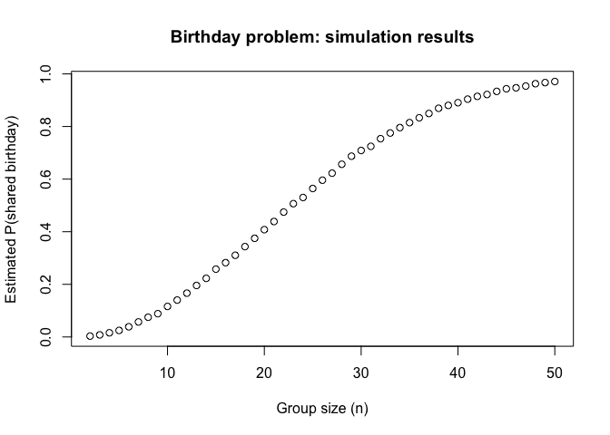
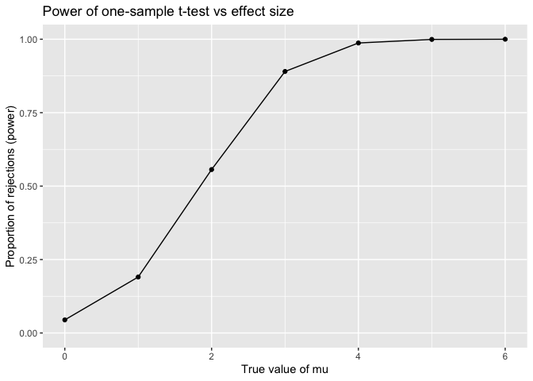
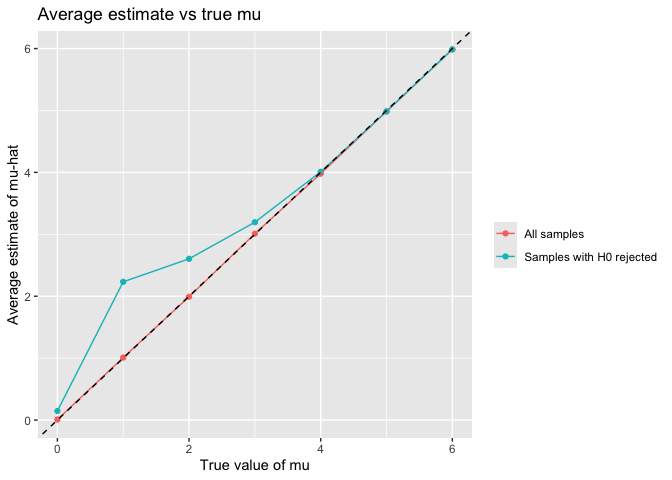
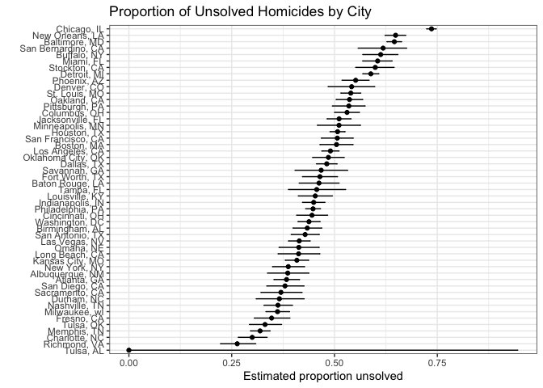

p8105_hw5_yc4804
================
Yilin Cai
2025-11-14

## Problem 1

``` r
set.seed(123)

birthday_sim<-function(n_people){
  birthdays<-sample(1:365, size = n_people, replace=TRUE)
  has_match<-any(duplicated(birthdays))
  return(has_match)
}


n_sims<-10000
group_sizes<- 2:50

prob_shared<- sapply(group_sizes, function(n){
  sim_results<-replicate(n_sims, birthday_sim(n))
  mean(sim_results)
})
results <- data.frame(
  group_size = group_sizes,
  prob_shared = prob_shared
)


plot(
  x = results$group_size,
  y = results$prob_shared,
  type = "b",                    # points connected by lines
  xlab = "Group size (n)",
  ylab = "Estimated P(shared birthday)",
  main = "Birthday problem: simulation results"
)
```

<!-- --> The
plot shows that the probability of at least two people sharing a
birthday increases quickly as group size grows. For small groups, the
chance is close to zero, but it rises sharply around 20–30 people,
reaching about a 50% probability near a group size of 23. By the time
the group size approaches 50, the probability is above 0.7. This
illustrates the birthday paradox: shared birthdays become likely much
sooner than intuition might suggest.

## Problem 2

``` r
library(tidyverse)
```

    ## ── Attaching core tidyverse packages ──────────────────────── tidyverse 2.0.0 ──
    ## ✔ dplyr     1.1.4     ✔ readr     2.1.5
    ## ✔ forcats   1.0.0     ✔ stringr   1.5.1
    ## ✔ ggplot2   3.5.2     ✔ tibble    3.3.0
    ## ✔ lubridate 1.9.4     ✔ tidyr     1.3.1
    ## ✔ purrr     1.1.0     
    ## ── Conflicts ────────────────────────────────────────── tidyverse_conflicts() ──
    ## ✖ dplyr::filter() masks stats::filter()
    ## ✖ dplyr::lag()    masks stats::lag()
    ## ℹ Use the conflicted package (<http://conflicted.r-lib.org/>) to force all conflicts to become errors

``` r
library(broom)

set.seed(123)

n <- 30
sigma <- 5
mu_vec <- 0:6
n_sims <- 5000

sim_results <-
  expand_grid(
    mu_true = mu_vec,
    sim_id = 1:n_sims
  ) |>
  mutate(
    x=map(mu_true, ~ rnorm(n = n, mean = .x, sd =sigma)),
    
    t_out = map(x, ~ tidy(t.test(.x, mu =0)))
  ) |>
  unnest(t_out) |>
  transmute(
    mu_true,
    sim_id,
    estimate,
    p_value = p.value,
    reject = p_value < 0.05
  )

power_df <-
  sim_results |>
  group_by(mu_true) |>
  summarise(
    power = mean(reject),
    .groups = "drop"
  )

ggplot(power_df, aes(x = mu_true, y = power)) +
  geom_point() +
  geom_line() +
  labs(
    x = "True value of mu",
    y = "Proportion of rejections (power)",
    title = "Power of one-sample t-test vs effect size"
  ) +
  ylim(0, 1)
```

<!-- -->

As the effect size (the true value of μ) increases, the power of the
one-sample t-test increases sharply. When μ is close to 0, the test
rarely rejects the null, resulting in very low power. As μ moves farther
from 0, the sample mean becomes more distinguishable from the null
value, leading to higher rejection rates. By μ ≈ 3–4, power approaches
1, meaning the test almost always detects the effect. Overall, larger
effect sizes make it much easier for the t-test to identify a true
difference.

``` r
avg_all <-
  sim_results |>
  group_by(mu_true) |>
  summarise(
    mean_est_all = mean(estimate),
    .groups = "drop"
  )

avg_reject <-
  sim_results |>
  filter(reject) |>
  group_by(mu_true) |>
  summarise(
    mean_est_reject = mean(estimate),
    .groups = "drop"
  )

## Combine for plotting with two lines
avg_df <-
  avg_all |>
  left_join(avg_reject, by = "mu_true") |>
  pivot_longer(
    cols = c(mean_est_all, mean_est_reject),
    names_to = "which_samples",
    values_to = "mean_est"
  ) |>
  mutate(
    which_samples = recode(
      which_samples,
      mean_est_all    = "All samples",
      mean_est_reject = "Samples with H0 rejected"
    )
  )

ggplot(avg_df, aes(x = mu_true, y = mean_est,
                   color = which_samples)) +
  geom_point() +
  geom_line() +
  geom_abline(intercept = 0, slope = 1, linetype = "dashed") +
  labs(
    x = "True value of mu",
    y = "Average estimate of mu-hat",
    color = "",
    title = "Average estimate vs true mu"
  )
```

<!-- -->

The average estimate of μ̂ across all samples lies close to the 45° line,
meaning μ̂ is an unbiased estimator of the true μ. However, when looking
only at samples where the null hypothesis was rejected, the average μ̂ is
noticeably higher than the true μ for small effect sizes. This happens
because conditioning on rejection selects only those samples with
unusually large sample means—those far enough from 0 to produce small
p-values. This “selection bias” inflates the average μ̂ among rejected
samples. Therefore, the sample average of μ̂ in rejected tests is not
approximately equal to the true μ, especially when μ is small, because
we are only keeping extreme samples that led to rejection.

## Problem 3

``` r
library(tidyverse)
library(broom)
library(purrr)

# Read homicide data from Washington Post GitHub
homicides <- read_csv(
  "homicide-data.csv"
)
```

    ## Warning: One or more parsing issues, call `problems()` on your data frame for details,
    ## e.g.:
    ##   dat <- vroom(...)
    ##   problems(dat)

    ## Rows: 52179 Columns: 12
    ## ── Column specification ────────────────────────────────────────────────────────
    ## Delimiter: ","
    ## chr (9): uid, victim_last, victim_first, victim_race, victim_age, victim_sex...
    ## dbl (3): reported_date, lat, lon
    ## 
    ## ℹ Use `spec()` to retrieve the full column specification for this data.
    ## ℹ Specify the column types or set `show_col_types = FALSE` to quiet this message.

``` r
# Quick description of raw data
glimpse(homicides)
```

    ## Rows: 52,179
    ## Columns: 12
    ## $ uid           <chr> "Alb-000001", "Alb-000002", "Alb-000003", "Alb-000004", …
    ## $ reported_date <dbl> 20100504, 20100216, 20100601, 20100101, 20100102, 201001…
    ## $ victim_last   <chr> "GARCIA", "MONTOYA", "SATTERFIELD", "MENDIOLA", "MULA", …
    ## $ victim_first  <chr> "JUAN", "CAMERON", "VIVIANA", "CARLOS", "VIVIAN", "GERAL…
    ## $ victim_race   <chr> "Hispanic", "Hispanic", "White", "Hispanic", "White", "W…
    ## $ victim_age    <chr> "78", "17", "15", "32", "72", "91", "52", "52", "56", "4…
    ## $ victim_sex    <chr> "Male", "Male", "Female", "Male", "Female", "Female", "M…
    ## $ city          <chr> "Albuquerque", "Albuquerque", "Albuquerque", "Albuquerqu…
    ## $ state         <chr> "NM", "NM", "NM", "NM", "NM", "NM", "NM", "NM", "NM", "N…
    ## $ lat           <dbl> 35.09579, 35.05681, 35.08609, 35.07849, 35.13036, 35.151…
    ## $ lon           <dbl> -106.5386, -106.7153, -106.6956, -106.5561, -106.5810, -…
    ## $ disposition   <chr> "Closed without arrest", "Closed by arrest", "Closed wit…

``` r
#Create city_state and summarize total & unsolved homicides

homicides2 <-
  homicides %>%
  mutate(
    city_state = str_c(city, ", ", state),
    unsolved = disposition %in% c("Closed without arrest", "Open/No arrest")
  ) %>%
  group_by(city_state) %>%
  summarise(
    total = n(),
    unsolved = sum(unsolved),
    .groups = "drop"
  )

homicides2
```

    ## # A tibble: 52 × 3
    ##    city_state      total unsolved
    ##    <chr>           <int>    <int>
    ##  1 Albuquerque, NM   378      146
    ##  2 Atlanta, GA       973      373
    ##  3 Baltimore, MD    2827     1825
    ##  4 Baton Rouge, LA   424      196
    ##  5 Birmingham, AL    800      347
    ##  6 Boston, MA        614      310
    ##  7 Buffalo, NY       521      319
    ##  8 Charlotte, NC     687      206
    ##  9 Chicago, IL      5535     4073
    ## 10 Cincinnati, OH    694      309
    ## # ℹ 42 more rows

``` r
# Extract Baltimore numbers
bmore <- homicides2 %>% filter(city_state == "Baltimore, MD")

# Run prop.test
bmore_test <- prop.test(
  x = bmore$unsolved,
  n = bmore$total
)

# Tidy output
bmore_tidy <- broom::tidy(bmore_test)

bmore_tidy %>% 
  select(estimate, conf.low, conf.high)
```

    ## # A tibble: 1 × 3
    ##   estimate conf.low conf.high
    ##      <dbl>    <dbl>     <dbl>
    ## 1    0.646    0.628     0.663

``` r
city_results <-
  homicides2 %>%
  mutate(
    prop_test = map2(unsolved, total, ~ prop.test(.x, .y)),
    tidy_out  = map(prop_test, broom::tidy)
  ) %>%
  unnest(tidy_out) %>%
  select(city_state, total, unsolved,
         estimate, conf.low, conf.high)
```

    ## Warning: There were 2 warnings in `mutate()`.
    ## The first warning was:
    ## ℹ In argument: `prop_test = map2(unsolved, total, ~prop.test(.x, .y))`.
    ## Caused by warning in `prop.test()`:
    ## ! Chi-squared approximation may be incorrect
    ## ℹ Run `dplyr::last_dplyr_warnings()` to see the 1 remaining warning.

``` r
city_results
```

    ## # A tibble: 52 × 6
    ##    city_state      total unsolved estimate conf.low conf.high
    ##    <chr>           <int>    <int>    <dbl>    <dbl>     <dbl>
    ##  1 Albuquerque, NM   378      146    0.386    0.337     0.438
    ##  2 Atlanta, GA       973      373    0.383    0.353     0.415
    ##  3 Baltimore, MD    2827     1825    0.646    0.628     0.663
    ##  4 Baton Rouge, LA   424      196    0.462    0.414     0.511
    ##  5 Birmingham, AL    800      347    0.434    0.399     0.469
    ##  6 Boston, MA        614      310    0.505    0.465     0.545
    ##  7 Buffalo, NY       521      319    0.612    0.569     0.654
    ##  8 Charlotte, NC     687      206    0.300    0.266     0.336
    ##  9 Chicago, IL      5535     4073    0.736    0.724     0.747
    ## 10 Cincinnati, OH    694      309    0.445    0.408     0.483
    ## # ℹ 42 more rows

``` r
city_results_clean <- city_results %>%
  filter(city_state != "PA, 40.461945") #This city state does not make sense to me.

city_results_clean %>%
  mutate(city_state = fct_reorder(city_state, estimate)) %>%
  ggplot(aes(x = city_state, y = estimate)) +
  geom_point() +
  geom_errorbar(aes(ymin = conf.low, ymax = conf.high), width = 0.15) +
  coord_flip() +
  labs(
    x = "",
    y = "Estimated proportion unsolved",
    title = "Proportion of Unsolved Homicides by City"
  ) +
  theme_bw()
```

<!-- -->

The plot shows large variation across U.S. cities in the proportion of
homicides that remain unsolved. Cities on the left (e.g., Richmond, VA)
solve most of their cases, while cities on the right (e.g., Chicago, IL;
New Orleans, LA; Baltimore, MD) have much higher unsolved proportions,
often above 60–70%. Confidence intervals are wider for cities with fewer
homicides, reflecting greater uncertainty. Overall, the plot highlights
that homicide clearance rates differ substantially by city.
